## Project Topic：Smart Parking System based on Machine Vision
### Team Members
* Yunhui Ma
* Menghua Xie
### Links
* [Repo](https://github.com/MenghuaXie/M202AFinalProject) 
* [Github Page](https://menghuaxie.github.io/M202AFinalProject/)
* [Midterm Presentaion](https://www.youtube.com/watch?v=kMS5N7UKCuk&t=5s)
### Project Introduction 
  
#### Motivation 
  
  * Finding parking spot can be time consuming especially during peak hours. 
  * We know that a lot of indoor parking lots have sensors on each parking slot to detect whether a car is parking. The available parking slot would turn on a green LED light to notify driver. In addition, the indoor parking lots have monitor to tell drivers how many parking slots are available.
  * But the outdoor parking lots do not have this system. It is not accurate to use sensors to detect vehicles from outdoor because the sensor can be affected by a leaf or something else. Also, flashing a LED light from outdoor is not easy to see. Therefore, it would be useful to implement a camera to check the available parking slots
  * Notify drivers the available parking slots especially during the peak time.
  
#### Goal 
  * Using Camera to check the parking spot. (CNN)  
  * creating a map that corresponding to the parking lot. 
  * The system can manage the data and show the imformation which parking slots are available. 
  * The information will be transferred to other device and tell users the available parking slots. 
  
#### Deliverable 
  * Week4: Decide equipment, research, programming language. 
  * Week5: Apply Machine learning to recognize cars (Analysis which models can be used) 
  * Week6: Testing image recognition, optimize the model  
  * Week7: Create a map that correspond to the parking lot. 
  * Week8: Matching the available parking slot 
  * Week9: Sending data to other device (mobile phone) 
  * Week10: Demo, final presentation 
  
### Hardware Used in This Project 
  * Camera, Mobile Phone, PC 


### Project Overview
Generally speaking, to recognize parking spots, it is necessary to classify and train for both cars and parking spots for ensuring the accuracy of prediction. But in reality, the ways that people use to identify a parking spot in diferent parking lots are diverse. In some parking lots, the parking spots may be separated by clear lines, while in other parking lots, there is no conspicuous and clear physical sign for identification, which will greatly increase the complexity of the project. On this basis, we decided to focus on the most essential part of parking spot recognition---car recognition. If cars can be identified precisely, we can cross-compare the prediction result with the pre-loaded parking spot information, and then easily achieve our goal. Then, on this basis, we will notify the user with the parking space information by sending messages to their phones.  
Based on this, we decided to use yolov5 to complete subsequent projects, and use twilio to sned information from PC to the phone.

##### Yolov5
Yolov5 is very similar to Yolov4, and it is still divided into four parts: Input, Backbone, Neck, Prediction. It provides 4 models for training and prediction: Yolov5s,Yolov5m,Yolov5l and Yolov5x. The input of Yolov5 uses the same Mosaic data enhancement method as Yolov4.  
In the Yolo algorithm, for different data sets, there will be anchor boxes with initial length and width. In network training, the network outputs the prediction frame based on the initial anchor frame, and then compares it with the groundtruth of the real frame, calculates the gap between the two, and then reverses the update to iterate the network parameters. This argorithm can provide a rather precise prediction when it comes to small targets in a high resolution image, which is a big improvement compared with its previous versions. In our project, because of the constraints of hardware, we mainly use Yolov5m model for training and prediction.
The structure of Yolov5 and algorithm performance test chart are shown below.

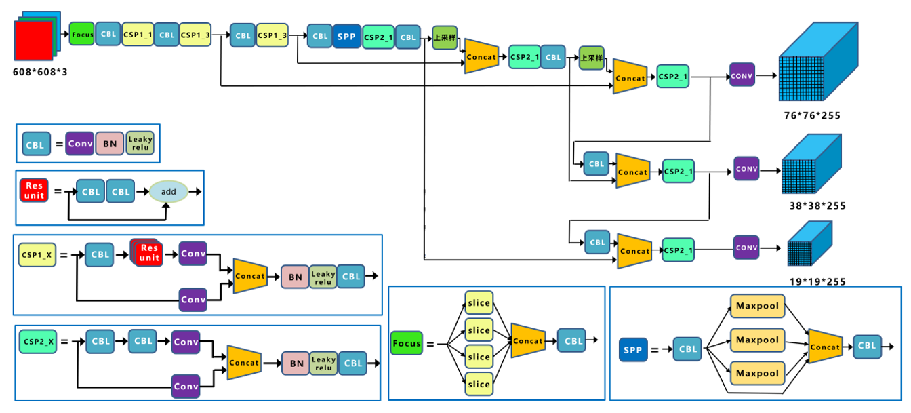  

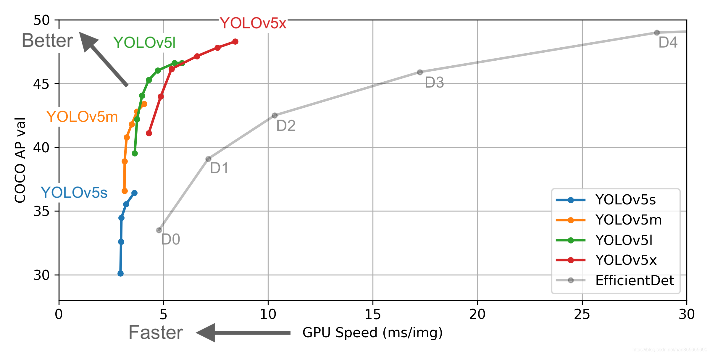  

##### Set Up
We use anaconda to setup a virtual environment with different libraries for python development.
For training and prediction based on yolov5, the required libraries are listed here:  
Cython  
numpy>=1.18.5  
opencv-python   
torch>=1.5.1   
matplotlib   
pillow   
tensorboard  
PyYAML>=5.3  
torchvision>=0.6  
scipy  
tqdm  
pycocotools>=2.0  
For message sending and receiving based on twilio, we also need to install twilio library.

##### Creating Training Data Set
Normally, car position prediction requires a data set containing car images from various directions. In the beginning phase of our project, we mainly focus on cars’ top view images since  cameras are often set at above in most open air parking lot. Otherwise they are placed at a reasonable height in order to obtain a larger view of the parking lot. Admittedly, cars which are parked away from cameras would be recorded from another side and that will reduce the prediction accuracy of our model. But this a good bake off for the total situation.  
As shown below, we collected 150 car top view images and use LabelImg to label out the cars. 

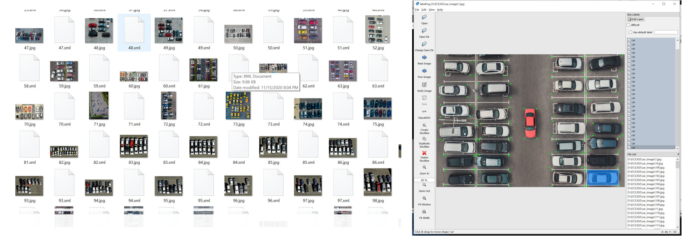  
After normalizing those pictures and randomly separate them into 2 groups at a ratio of 9:1 for training and verification. WE have the dataset available.

##### Training Process and Result
We train the date set for 300 epochs using yolov5m and get 2 weights, the best one and the last one and we choose the best one for prediction. 

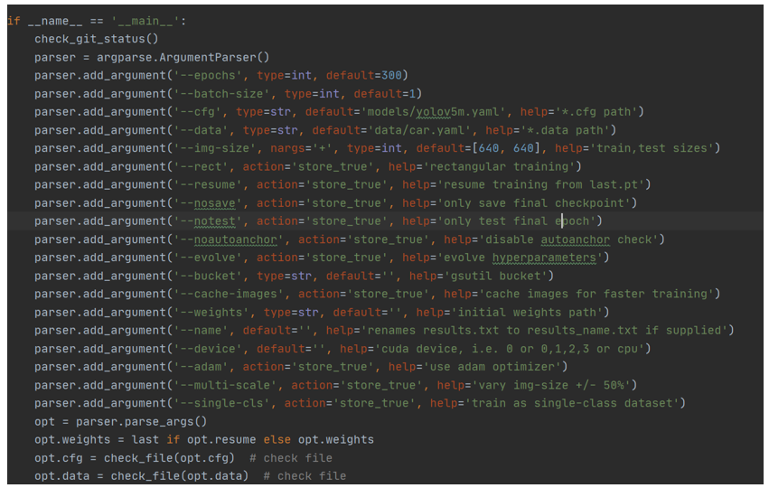  
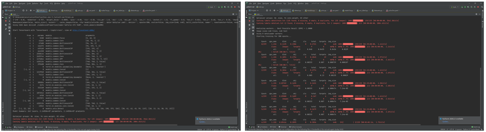  

Estimated time for the training process is about 5 hours. (limited by the gpu, GeForce GTX 960M)  
The training result is also shown below. As we can see the loss is getting smaller and smaller so the training result can meet our expectation.  
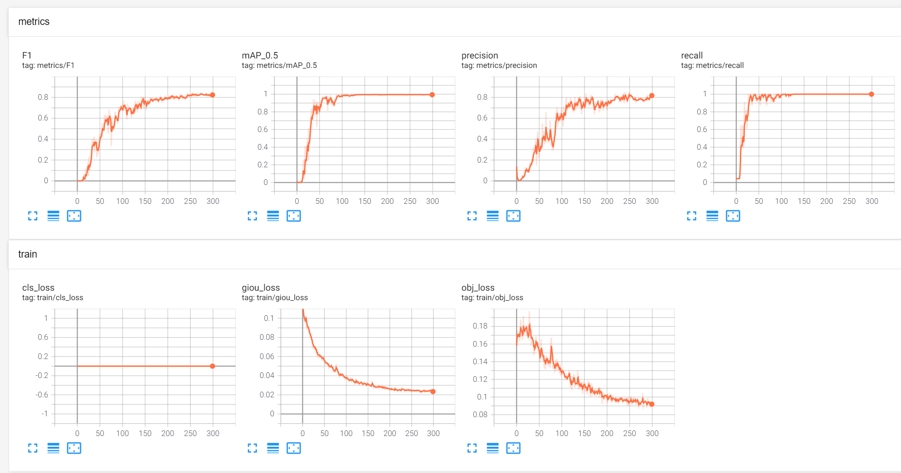  

##### Prediction Result
We applied two ways to test the result: loading image test and using a camera. At the first stage, test image and video is the top view of a parking lot, with clearly marked parking spots. Individual test results are shown below.  
Using camera to test:  
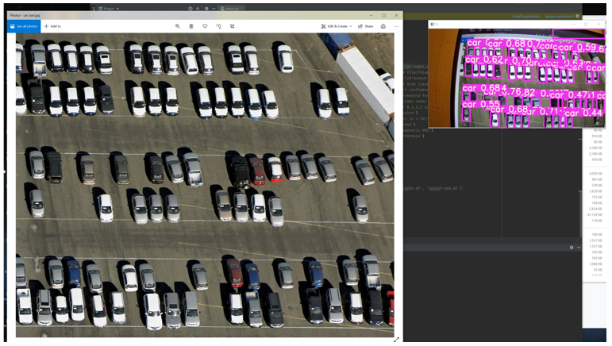  
loading image test:   
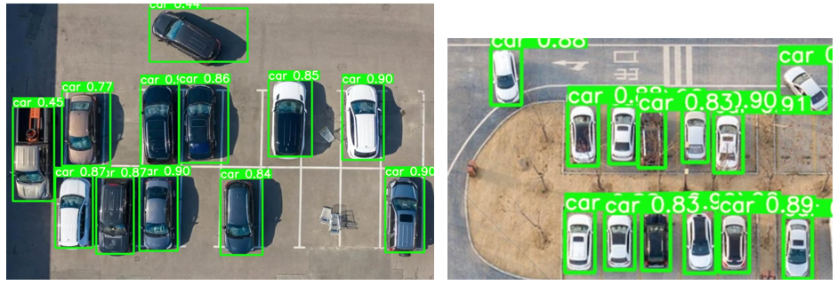  
The test result shows that our model can predict the position of cars quite precisely, and the result refreshs rapidly in the camera test. It means we are able to obtain real time data of cars' position and provide feedback to users in the form of sending message. The prediction code works in a look while using camera for testing, so, in this case, a message sending button will be needed to control when will the message be sent.

##### Sending Message to the Phone 
The information that we need to convey is ready after of during the prediction process. As mentioned earlier, we need to create a map and compare it with the prediction result to  check whether parking slots are empty. It is difficult to find a recording video in the public parking lot. In order to simulate the project, we just use 4 images including 14 parking slots and some vehicles in different locations. Following is how we match the prediction result with a pre-established map.
* In order to achieve mapping, we draw 14 bounding boxes in the 640x320 video recording camera view. Those 14 bounding boxes positions are fixed. Each boxes would have their own coordinate. Those bounding boxes would be used to match the parking slots to see whether a car is inside the bounding boxes.

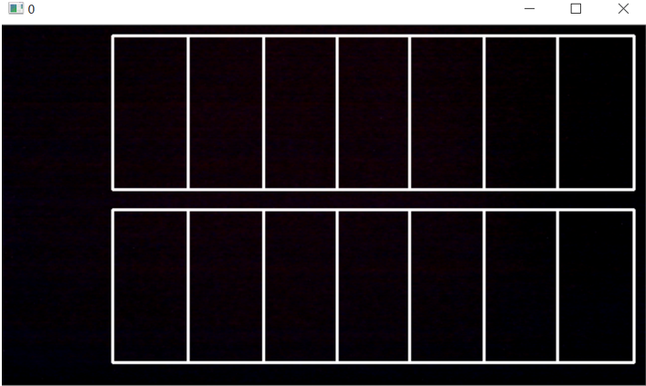  

* Inside the detect() function, when the algorithm detects the vehicle objects in the video. The vehicle pixel locations (x, y) are stored in the det. xyxy[] which is obtained from det object is the pixel location corresponding to each detected vehicle. Then, use these information to calculate the center point of each boxes.  

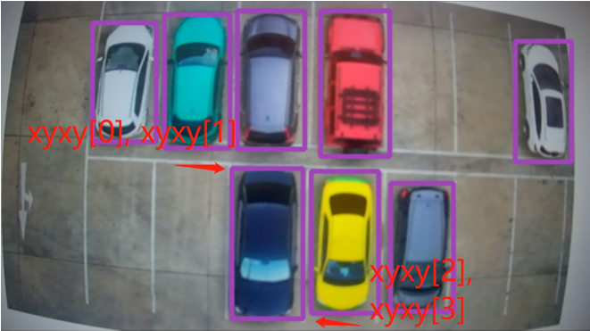  

* Check their center points to see if they are inside the bounding boxes. The park_nums[0-13] array is used to recording whether the parking slots are occurred.  

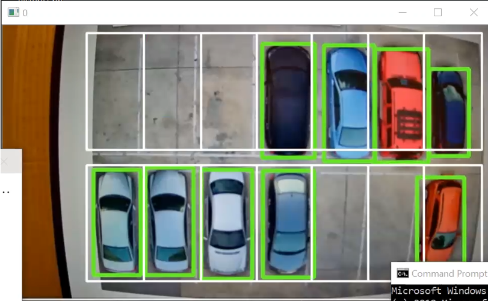  

* In this case, from the image, we can see that there 5 parking slots are empty. In the terminal, it is printing out the message showing that the first three, and second and third last parking slots are empty. The rest of parking slots are occurred. 0 represents the empty parking slots, and 1 represents the occurred parking slots.  
There are total 9 cars and 5 spaces in this case.  

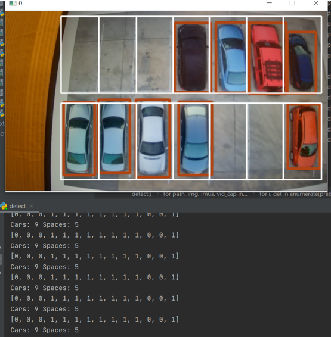

We will use twilio to get a free trail phone number and perform the function of sending message. Here is the code used in this part：  
```python
from twilio.rest import Client
account_sid = "ACbfe2ada64f41c41b0854e7b483735232"
auth_token = "086d3a23a1336240b36926abb3572983"
Spaces = 13
Cars = 1
client = Client(account_sid, auth_token)
content = "There are 14 slots in total, " + str(Cars) + " of them occupied, " + str(Spaces) + " of them available." + ""
message = client.messages.create(
    to="+86xxxxxxxxxxx",
    from_="+16516614003",
    body=content)
```

Also, we created a button to send a message to the phone after clicking the button. The prediction result will also be ready after the code starts running. Pressing the button will be like a request for getting information.  
  

Test result are shown here:  
Once the button is clicked, phone would receive a message including the parking space information.
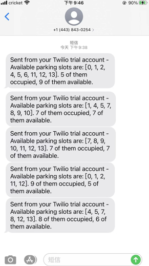  

### Summary
* In this project, it has good prediction on a smaller scale of parking lot such as the demo that we showed.
* Testing on larger scale of parking lot would require a lot of images to train in order to get a good prediction result. It is time consuming on training the model. In addition, the training should include different angel of car view. In our project, the training data set only includes the top view of cars.
* Due to the limitation of camera, the edges of the image recorded by camera are curved, which would affect the prediction.
* It would need a lot of time to create bounding boxes to achieve mapping on the larger scale of parking lots.
* The system should work on the outdoor parking lots because the cameras will be equipped at the top of place to get the top view images. Each camera should be able to detect more than 100 parking slots, and it only needs few cameras to capture the whole parking lot.
* Due to the higher performance of CNN model, it is affected by external factors.
* The system can provide useful message to people to find an available parking slot in large outdoor parking lot during the peak time. 

### Future Work


### Reference
https://github.com/ultralytics/yolov5  
https://www.tensorflow.org/tensorboard  
https://www.shutterstock.com/search/parking+lot+top+view  

